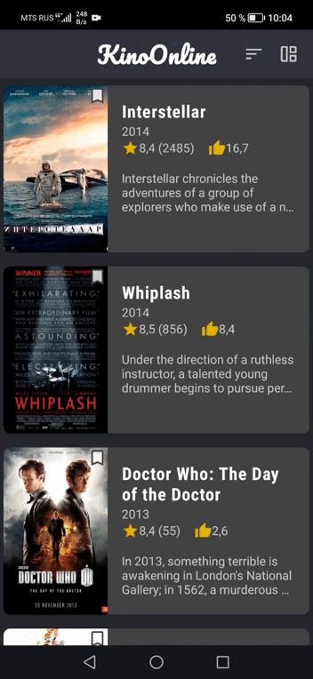

# KinoOnline
KinoOnline is an application that makes watching movies on Android easier.  
KinoOnline supports two themes - Light and Dark. You can toggle it in your smartphone settings.  

**Languages and tools used in this project:**
* _**Kotlin**_ as a main programming language
* _**Koin**_ as a Dependency Injection framework
* _**Retrofit**_ as an HTTP-client
* _**GSON**_ as a JSON to DTO converter
* _**Coroutines**_ for a multithreading
* _**Cicerone**_ as a screens' navigation
* _**Glide**_ for an image loading
* _**ExoPlayer**_ for a video player

## Screens
### Main Screen
On the main screen you will see several movie cards that you can scroll vertically and group by columns. 
Tap on the movie card to open _About Movie Screen_.  
You can see it in demo section below in the _Demo_.  

### About Movie Screen
On the _About Movie Screen_ you will see film poster, genres, year of release and overview  
Tap on the play icon to open _Video Player Screen_. 

### Video Player Screen
On the _Video Player Screen_ you will watch selected movie in full screen mode.  

## Demo
Below you can see a demo of CiOn application.  
